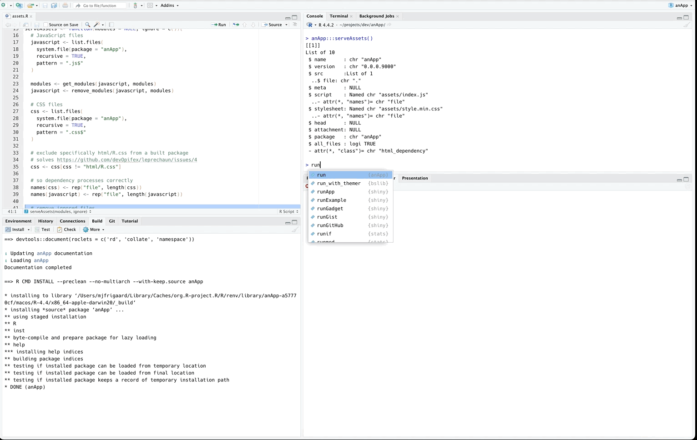

<!-- README.md is generated from README.Rmd. Please edit that file -->

```{r, include = FALSE}
knitr::opts_chunk$set(
  collapse = TRUE,
  comment = "#>",
  fig.path = "man/figures/README-",
  out.width = "100%"
)
```

# anApp

<!-- badges: start -->
<!-- badges: end -->

The goal of `anApp` is to demonstrate the [issue](https://github.com/devOpifex/leprechaun/issues/17) with the `use_`/`_build` function workflow.

## Installation

You can install the development version of `anApp` from [GitHub](https://github.com/) with:

``` r
# install.packages("pak")
pak::pak("mjfrigaard/anApp")
```

## App

``` r
library(anApp)
run()
```

### Possible Fix 

In `R/assets.R`: 

```{r}
#| eval: false
serveAssets <- function(modules = NULL, ignore = c()){
	# JavaScript files
	javascript <- list.files(
		system.file(package = "anApp"),
		recursive = TRUE,
		pattern = ".js$"
	)

	modules <- get_modules(javascript, modules)
	javascript <- remove_modules(javascript, modules)

	# CSS files
	css <- list.files(
		system.file(package = "anApp"),
		recursive = TRUE,
		pattern = ".css$"
	)

  # exclude specifically html/R.css from a built package
  # solves https://github.com/devOpifex/leprechaun/issues/4
  css <- css[css != "html/R.css"]

	# so dependency processes correctly
	names(css) <- rep("file", length(css))
	names(javascript) <- rep("file", length(javascript))

	# remove ignored files
	if (length(ignore > 0)) {
	ignore_pat <- paste0(ignore, collapse = "|", sep = "$")
	css <- css[!grepl(ignore_pat, css)]
	javascript <- javascript[!grepl(ignore_pat, javascript)]
	}

	# serve dependencies
	dependencies <- list()

	standard <- htmlDependency(
		"anApp",
		version = utils::packageVersion("anApp"),
		package = "anApp",
		src = ".",
		script = javascript,
		stylesheet = css
	)
	dependencies <- append(dependencies, list(standard))

	if (!is.null(modules)) {
		modules <- htmlDependency(
			"anApp-modules",
			version = utils::packageVersion("anApp"),
			package = "anApp",
			src = ".",
			script = modules,
			meta = list(type = "module")
		)
		dependencies <- append(dependencies, list(modules))
	}

	return(dependencies)
}
```



